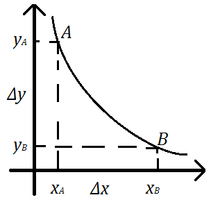

<!--DEBUG-->



## Запитання на другий колоквіум

- [Теорія споживання](#теорія-споживання)

	1. [Простір товарів. Відношення переваги. Аксіоми.](#1-простір-товарів-відношення-переваги-аксіоми)

	2. [Функція корисності. Теорема Дебре.](#2-функція-корисності-теорема-дебре)

	3. [Крива байдужості. Гранична норма заміщення благ.](#3-крива-байдужості-гранична-норма-заміщення-благ)

	4. [Неокласична задача споживання. Умови оптимальності.](#4-неокласична-задача-споживання-умови-оптимальності)

	5. [Задача споживання за Хіксом. Умови оптимальності.](#5-задача-споживання-за-хіксом-умови-оптимальності)

### Теорія виробництва

#### 1. Еластичність випуску. Еластичність заміщення. Масштаб виробництва

#### 2. Досконала конкуренція. Попит, виручка та прибуток конкурентної фірми

#### 3. Максимізація прибутку фірми (графічний та аналітичний розв'язки)

#### 4. Однопродуктова фірма (3моделі поведінки фірми)

#### 5. Монополія, монопсонія

#### 6. Дуополія Курно, Штаккельберга. Гадані варіації

#### 7. Багатопродуктове виробництво (2 моделі поведінки фірми)

## _І навіть відповіді!_

### Теорія споживання

#### 1. Простір товарів. Відношення переваги. Аксіоми.

Під _товаром_ будемо розуміти споживче благо або послугу, що надійшла в певний час в певному місці.

Під _споживачем_ будемо розуміти групу індивідів, які спільно розподіляють свій дохід на придбання товарів.

Вважаємо, що існує обмежена кількість наявних товарів, які мають властивість _довільної подільності_ (тобто, можна придбати довільну дійсну кількість кожного товару, а не лице натуральну).

Вибір споживача можна охарактеризувати набором товарів

$$
x = (x_1, x_2, \ldots, x_n) \in X \subseteq \mathbb{R}_+^n.
$$

Множину $$X$$ називають простором товарів.

Вибір споживачем деякого набору товарів характеризується суб'єктивним бінарним відношенням _переваги_ (позначається $$\succeq$$).

Пара $$(X, \succeq)$$ називається _полем переваг_ споживача.

Вибір споживача зазвичай стимулюється обмеженим бюджетом. До бюджетних факторів належать ціни $$p_i$$, $$i = \overline{1, n}$$, а також рівень споживчого доходу $$I$$.

Якщо ввести до розгялду вектор цін, то споживач при виборі набору $$X$$ товарів повинен враховувати _бюджетне обмеження_ вигляду

$$
\langle p, x \rangle = \displaystyle\sum\limits_{i=1}^n p_i \cdot x_i \le I
$$

Таким чином _допустимі_ набори товарів в просторів $$\mathbb{R}_+^n$$ задовольняють  обмеження вище і утворюють _споживчий симплекс_:

$$
S_n = \left\{ x \in \mathbb{R}_+^n \middle| \langle p, x \rangle \le I \right\},
$$

який є замкненою і опуклою множиною в просторі $$\mathbb{R}_+^n$$.

#### 2. Функція корисності. Теорема Дебре.

Числова функція $$u: X \to \mathbb{R}$$ називається _індикатором переваги_ або _функцією корисності_, якщо вона _зображає_ відношення переваги, тобто

$$
\forall x, y \in X: \quad x \succeq y \iff u(x) \ge u(y).
$$

Якщо функція $$u$$ є диференційовною, то існує похідна

$$
M u = \frac{\mathrm{d} u(x)}{\mathrm{d} x} = \left( \frac{\partial u(x)}{\partial x_i} \right)_{i = 1}^n = ( M u_i )_{i = 1}^n,
$$

яка називається граничною корисністю (її компоненти &mdash; граничні корисності окремих товарів).

Будемо вважати, що $$\forall x, y \in X$$ виконується 

$$
\begin{aligned}
	u(\lambda x + (1 - \lambda) y) &\ge \lambda u(x) + (1 - \lambda) u(y), \quad \lambda \in [0, 1], \\
	u(\lambda x + (1 - \lambda) y) &> \lambda u(x) + (1 - \lambda) u(y), \quad \lambda \in (0, 1).
\end{aligned}
$$

Якщо функція $$u$$ є двічі диференційовною, то існує матриця Гессе:

$$
u''(x) = \frac{\mathrm{d}^2 u(x)}{\mathrm{d} x^2} = \left( \frac{\partial^2 u(x)}{\partial x_i \partial x_j} \right)_{i, j = 1}^n
$$

і виконується закон Гессена:

$$
\frac{\partial^2 u(x)}{\partial x_i^2} < 0, \quad i = \overline{1, n},
$$

тобто гранична корисність довільного товару зменшується зі збільшенням споживання цього товару.

**Приклади** найбільш вживаних функцій корисності:

1. Квадратична: 
	
	$$
	u(x) = \frac{1}{2} x^\intercal A x + \vec b x + c,
	$$ 

	де $$c > 0$$, але $$A \ll 0$$.

2. Мультиплікативна: 

	$$
	u(x) = a \displaystyle\prod\limits_{i = 1}^n x_i^{\alpha_i},
	$$

	де $$a > 0$$, а $$\alpha_i \in (0, 1)$$.

3. Логарифмічна (Бернуллі): 

	$$
	u(x) = \displaystyle\sum\limits_{i = 1}^n a_i \log_b(x_i - \bar x_i),
	$$

	де $$b > 1$$, $$a_i > 0$$, $$x_i > \bar x_i > 0$$ &mdash; мінімальна допустима кількість товару.

4. Зі сталою величиною (??): 

	$$
	u(x) = \displaystyle\sum\limits_{i = 1}^n \frac{a_i}{1 - b_i} (x_i - \bar x_i)^{1 - b_i},
	$$

	де $$a_i > 0$$, $$0 < b_i < 1$$, $$x_i > \bar x_i > 0$$ &mdash; мінімальна допустима кількість товару.

**Теорема (Дебре).** Якщо $$X$$ &mdash; зв'язна множина, а відношення переваги є неперервним, то існує функція корисності $$u(x)$$ яка зображає відповідне поле переваг.

_Без доведення._

Зауважимо, що якщо функція корисності $$u(\cdot)$$ зображає відношення $$\succeq$$, а $$f : \mathbb{R} \to \mathbb{R}$$ &mdash; довільна монотонна функція, то їх композиція $$f(u(\cdot))$$ також зображає відношення $$\succeq$$.

#### 3. Крива байдужості. Гранична норма заміщення благ.

Кожна людина в процесі прийняття індивідуального рішення про витрачання свого доходу керується власними смаками, бажаннями, та вподобаннями. Ресурси споживача є _обмеженими_ відносно його бажань. 

І хоча ми не можемо передбачити на що конкретно споживач вирішить витратити свій дохід, проте ми можемо сформулювати основні припущення, які визначають те чи інше рішення споживача, а також умови, за яких забезпечується _максимізація_ його корисності.

<!-- В аналізі поведінки споживача візьмемо за основу припущення про його сувернітет. -->

В основі теорії раціональної поведінки користувача лежать наступні припущення:

1. споживач знає, чого він знає;

2. може порівнювати доступні йому набори товарів;

3. вибирає той набір товарів, якому він надає найбільшу перевагу.

_Кривою байдужості_ будемо називати лінію (у вищих розмірностях &mdash; поверхню і гіперповерхню відповідно) рівної корисності, всі точки якої характеризують набори товарів, що забезпечують споживачеві один і той же рівень корисності:

Як бачимо, для того, щоб спожити більшу кількість одного блага в наборі споживач повинен відмовитися від певної кількості іншого блага.

Кількість блага $$y$$ від якої потрібно відмовитися в обмін на одну додаткову одиницю блага $$x$$ при незмінному загальному рівні корисності називається _граничною нормою заміщення_ благ:

$$
\frac{\mathrm{d} y}{\mathrm{d} x} = \displaystyle\lim\limits_{\Delta x \to 0} \left( - \frac{\Delta y}{\Delta x} \right).
$$

В цілому кривим байдужості притаманні такі властивості:

- мають від'ємний нахил;

- не перетинаються;

- далі від початку координат &mdash; більша корисність;

- вздовж (при $$x \to \infty$$) кривої байдужості гранична норма заміщення зменшується.

#### 4. Неокласична задача споживання. Умови оптимальності.

Якщо функція корисності є двічі неперервно-диференційовною та строго опуклою, а бюджетне обмеження має вигляд $$\langle p, x \rangle \le I$$, то раціональна поведінки споживача визначається такою задачею

$$
u(x) \xrightarrow[\substack{\langle p, x\rangle \le I \\ x \in \mathbb{R}_+^n}]{} \max.
$$

Оскільки допустима множина є компактною, опуклою, і замкненою, то задача має єдиний розв'язок $$x^\star$$.

Розглянемо функцію Лагранжа цієї задачі:

$$
L(x, \lambda) = u(x) + \lambda (I - \langle p, x \rangle).
$$

Як відомо, необхідними умовами оптимальності є наступні:

$$
\left\{
\begin{aligned}
& \frac{\partial L(x^\star, \lambda^\star)}{\partial x} = Mu(x^\star) + \lambda^\star p \le 0, \\
& \frac{\partial L(x^\star, \lambda^\star)}{\partial \lambda} = I - \langle p, x \rangle \ge 0, \\
& \left\langle x^\star, \frac{\partial L(x^\star, \lambda^\star)}{\partial x} \right\rangle = \left\langle x^\star, Mu(x^\star) - \lambda^\star p \right\rangle = 0, \\
& \lambda^\star \cdot \frac{\partial L(x^\star, \lambda^\star)}{\partial \lambda} = \lambda^\star \cdot (I - \langle p, x \rangle) = 0, \\
& x^\star, \lambda^\star \ge 0.
\end{aligned}
\right.
$$

Оптимальний (штрафний) множник $$\lambda^\star$$ можна інтерпретувати як граничну корисність додаткового доходу:

$$
\lambda^\star = \frac{\partial u(x^\star(p, I))}{\partial I}.
$$

Можна також інтерпретувати задачу геометрично: розв'язок лежить на _бюджетній лінії_ (геометрчине місце точок які відповідають наборам товарів за яких споживач опвністю витрачає свій дохід).

#### 5. Задача споживання за Хіксом. Умови оптимальності.

---

[Назад на головну](../README.md)