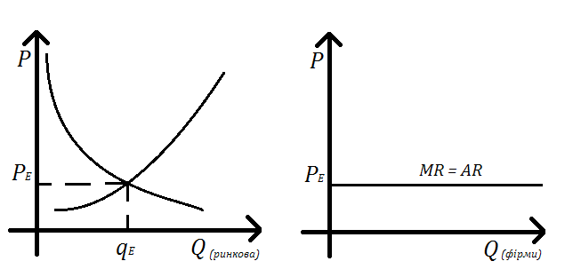
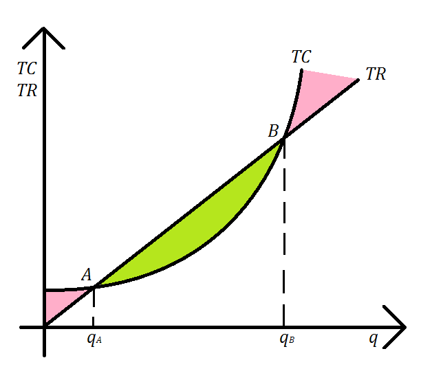
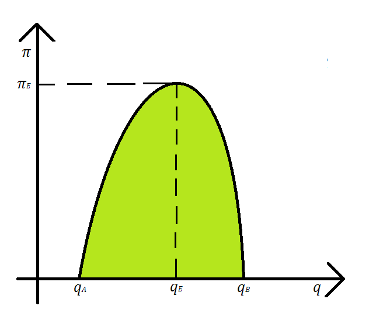

<!--DEBUG-->



## Запитання на другий колоквіум

- [Теорія споживання](#теорія-споживання)

	1. [Простір товарів. Відношення переваги. Аксіоми.](#1-простір-товарів-відношення-переваги-аксіоми)

	2. [Функція корисності. Теорема Дебре.](#2-функція-корисності-теорема-дебре)

	3. [Крива байдужості. Гранична норма заміщення благ.](#3-крива-байдужості-гранична-норма-заміщення-благ)

	4. [Неокласична задача споживання. Умови оптимальності.](#4-неокласична-задача-споживання-умови-оптимальності)

	5. [Задача споживання за Хіксом. Умови оптимальності.](#5-задача-споживання-за-хіксом-умови-оптимальності)

- [Теорія виробництва](Теорія-виробництва)

	1. [Еластичність випуску. Еластичність заміщення. Масштаб виробництва.](#1-еластичність-випуску-еластичність-заміщення-масштаб-виробництва)

	2. [Досконала конкуренція. Попит, виручка та прибуток конкурентної фірми.](#2-досконала-конкуренція-попит-виручка-та-прибуток-конкурентної-фірми)

	3. [Максимізація прибутку фірми (графічний та аналітичний розв'язки).](#3-максимізація-прибутку-фірми-графічний-та-аналітичний-розвязки)

	4. [Однопродуктова фірма (3 моделі поведінки фірми).](#4-однопродуктова-фірма-3-моделі-поведінки-фірми)

	5. [Монополія, монопсонія.](#5-монополія-монопсонія)

	6. [Дуополія Курно, Штаккельберга. Гадані варіації.](#6-дуополія-курно-штаккельберга-гадані-варіації)

	7. [Багатопродуктове виробництво (2 моделі поведінки фірми).](#7-багатопродуктове-виробництво-2-моделі-поведінки-фірми)

## _І навіть відповіді!_

### Теорія споживання

#### 1. Простір товарів. Відношення переваги. Аксіоми.

Під _товаром_ будемо розуміти споживче благо або послугу, що надійшла в певний час в певному місці.

Під _споживачем_ будемо розуміти групу індивідів, які спільно розподіляють свій дохід на придбання товарів.

Вважаємо, що існує обмежена кількість наявних товарів, які мають властивість _довільної подільності_ (тобто, можна придбати довільну дійсну кількість кожного товару, а не лице натуральну).

Вибір споживача можна охарактеризувати набором товарів

$$
x = (x_1, x_2, \ldots, x_n) \in X \subseteq \mathbb{R}_+^n.
$$

Множину $$X$$ називають простором товарів.

Вибір споживачем деякого набору товарів характеризується суб'єктивним бінарним відношенням _переваги_ (позначається $$\succeq$$).

Пара $$(X, \succeq)$$ називається _полем переваг_ споживача.

Вибір споживача зазвичай стимулюється обмеженим бюджетом. До бюджетних факторів належать ціни $$p_i$$, $$i = \overline{1, n}$$, а також рівень споживчого доходу $$I$$.

Якщо ввести до розгляду вектор цін, то споживач при виборі набору $$X$$ товарів повинен враховувати _бюджетне обмеження_ вигляду

$$
\langle p, x \rangle = \displaystyle\sum\limits_{i=1}^n p_i \cdot x_i \le I
$$

Таким чином _допустимі_ набори товарів в просторів $$\mathbb{R}_+^n$$ задовольняють  обмеження вище і утворюють _споживчий симплекс_:

$$
S_n = \left\{ x \in \mathbb{R}_+^n \middle| \langle p, x \rangle \le I \right\},
$$

який є замкненою і опуклою множиною в просторі $$\mathbb{R}_+^n$$.

#### 2. Функція корисності. Теорема Дебре.

Числова функція $$u: X \to \mathbb{R}$$ називається _індикатором переваги_ або _функцією корисності_, якщо вона _зображає_ відношення переваги, тобто

$$
\forall x, y \in X: \quad x \succeq y \iff u(x) \ge u(y).
$$

Якщо функція $$u$$ є диференційовною, то існує похідна

$$
M u = \frac{\mathrm{d} u(x)}{\mathrm{d} x} = \left( \frac{\partial u(x)}{\partial x_i} \right)_{i = 1}^n = ( M u_i )_{i = 1}^n,
$$

яка називається граничною корисністю (її компоненти &mdash; граничні корисності окремих товарів).

Будемо вважати, що $$\forall x, y \in X$$ виконується 

$$
\begin{aligned}
	u(\lambda x + (1 - \lambda) y) &\ge \lambda u(x) + (1 - \lambda) u(y), \quad \lambda \in [0, 1], \\
	u(\lambda x + (1 - \lambda) y) &> \lambda u(x) + (1 - \lambda) u(y), \quad \lambda \in (0, 1).
\end{aligned}
$$

Якщо функція $$u$$ є двічі диференційовною, то існує матриця Гессе:

$$
u''(x) = \frac{\mathrm{d}^2 u(x)}{\mathrm{d} x^2} = \left( \frac{\partial^2 u(x)}{\partial x_i \partial x_j} \right)_{i, j = 1}^n
$$

і виконується закон Гессена:

$$
\frac{\partial^2 u(x)}{\partial x_i^2} < 0, \quad i = \overline{1, n},
$$

тобто гранична корисність довільного товару зменшується зі збільшенням споживання цього товару.

**Приклади** найбільш вживаних функцій корисності:

1. Квадратична: 
	
	$$
	u(x) = \frac{1}{2} x^\intercal A x + \vec b x + c,
	$$ 

	де $$c > 0$$, але $$A \ll 0$$.

2. Мультиплікативна: 

	$$
	u(x) = a \displaystyle\prod\limits_{i = 1}^n x_i^{\alpha_i},
	$$

	де $$a > 0$$, а $$\alpha_i \in (0, 1)$$.

3. Логарифмічна (Бернуллі): 

	$$
	u(x) = \displaystyle\sum\limits_{i = 1}^n a_i \log_b(x_i - \bar x_i),
	$$

	де $$b > 1$$, $$a_i > 0$$, $$x_i > \bar x_i > 0$$ &mdash; мінімальна допустима кількість товару.

4. Зі сталою величиною (??): 

	$$
	u(x) = \displaystyle\sum\limits_{i = 1}^n \frac{a_i}{1 - b_i} (x_i - \bar x_i)^{1 - b_i},
	$$

	де $$a_i > 0$$, $$0 < b_i < 1$$, $$x_i > \bar x_i > 0$$ &mdash; мінімальна допустима кількість товару.

**Теорема (Дебре).** Якщо $$X$$ &mdash; зв'язна множина, а відношення переваги є неперервним, то існує функція корисності $$u(x)$$ яка зображає відповідне поле переваг.

_Без доведення._

Зауважимо, що якщо функція корисності $$u(\cdot)$$ зображає відношення $$\succeq$$, а $$f : \mathbb{R} \to \mathbb{R}$$ &mdash; довільна монотонна функція, то їх композиція $$f(u(\cdot))$$ також зображає відношення $$\succeq$$.

#### 3. Крива байдужості. Гранична норма заміщення благ.

Кожна людина в процесі прийняття індивідуального рішення про витрачання свого доходу керується власними смаками, бажаннями, та вподобаннями. Ресурси споживача є _обмеженими_ відносно його бажань. 

І хоча ми не можемо передбачити на що конкретно споживач вирішить витратити свій дохід, проте ми можемо сформулювати основні припущення, які визначають те чи інше рішення споживача, а також умови, за яких забезпечується _максимізація_ його корисності.

<!-- В аналізі поведінки споживача візьмемо за основу припущення про його сувернітет. -->

В основі теорії раціональної поведінки користувача лежать наступні припущення:

1. споживач знає, чого він знає;

2. може порівнювати доступні йому набори товарів;

3. вибирає той набір товарів, якому він надає найбільшу перевагу.

_Кривою байдужості_ будемо називати лінію (у вищих розмірностях &mdash; поверхню і гіперповерхню відповідно) рівної корисності, всі точки якої характеризують набори товарів, що забезпечують споживачеві один і той же рівень корисності:

Як бачимо, для того, щоб спожити більшу кількість одного блага в наборі споживач повинен відмовитися від певної кількості іншого блага.

Кількість блага $$y$$ від якої потрібно відмовитися в обмін на одну додаткову одиницю блага $$x$$ при незмінному загальному рівні корисності називається _граничною нормою заміщення_ благ:

$$
\frac{\mathrm{d} y}{\mathrm{d} x} = \displaystyle\lim\limits_{\Delta x \to 0} \left( - \frac{\Delta y}{\Delta x} \right).
$$

В цілому кривим байдужості притаманні такі властивості:

- мають від'ємний нахил;

- не перетинаються;

- далі від початку координат &mdash; більша корисність;

- вздовж (при $$x \to \infty$$) кривої байдужості гранична норма заміщення зменшується.

#### 4. Неокласична задача споживання. Умови оптимальності.

Якщо функція корисності є двічі неперервно-диференційовною та строго опуклою, а бюджетне обмеження має вигляд $$\langle p, x \rangle \le I$$, то раціональна поведінки споживача визначається такою задачею

$$
u(x) \xrightarrow[\substack{\langle p, x\rangle \le I \\ x \in \mathbb{R}_+^n}]{} \max.
$$

Оскільки допустима множина є компактною, опуклою, і замкненою, то задача має єдиний розв'язок $$x^\star$$. _У цій моделі $$x^\star = x^\star(p, I)$$._

Розглянемо функцію Лагранжа цієї задачі:

$$
L(x, \lambda) = u(x) + \lambda (I - \langle p, x \rangle).
$$

Як відомо, необхідними умовами оптимальності є наступні:

$$
\left\{
\begin{aligned}
& \frac{\partial L(x^\star, \lambda^\star)}{\partial x} = Mu(x^\star) + \lambda^\star p \le 0, \\
& \frac{\partial L(x^\star, \lambda^\star)}{\partial \lambda} = I - \langle p, x \rangle \ge 0, \\
& \left\langle x^\star, \frac{\partial L(x^\star, \lambda^\star)}{\partial x} \right\rangle = \left\langle x^\star, Mu(x^\star) - \lambda^\star p \right\rangle = 0, \\
& \lambda^\star \cdot \frac{\partial L(x^\star, \lambda^\star)}{\partial \lambda} = \lambda^\star \cdot (I - \langle p, x \rangle) = 0, \\
& x^\star, \lambda^\star \ge 0.
\end{aligned}
\right.
$$

Оптимальний (штрафний) множник $$\lambda^\star$$ можна інтерпретувати як граничну корисність додаткового доходу:

$$
\lambda^\star = \frac{\partial u(x^\star(p, I))}{\partial I}.
$$

Можна також інтерпретувати задачу геометрично: розв'язок лежить на _бюджетній лінії_ (геометрчине місце точок які відповідають наборам товарів за яких споживач опвністю витрачає свій дохід).

#### 5. Задача споживання за Хіксом. Умови оптимальності.

Розглянемо задачу споживання за Хіксом:

$$
\displaystyle\sum\limits_{i = 1}^n p_i x_i \xrightarrow[\substack{u(x) \ge u_0 \\ x \in \mathbb{R}_+^n}]{} \min,
$$

тобто відбувіється мінімізація втрат за умови досягнення мінімального рівня корисності. _У цій моделі $$x^\star = x^\star(p, u_0)$$._

Для цієї задачі також будується (вже інша) функція Лагранжа:

$$
L(x, \lambda) = - \displaystyle\sum\limits_{i = 1}^n p_i x_i + \lambda (u(x) - u_0),
$$

для якої мають виконуватися наступні умови оптимальності:

$$
\left\{
\begin{aligned}
& \frac{\partial L(x^\star, \lambda^\star)}{\partial x} = - p + \lambda Mu = 0, \\
& \frac{\partial L(x^\star, \lambda^\star)}{\partial \lambda} = u(x) - u_0 = 0.
\end{aligned}
\right.
$$

Отриманий в результаті вектор $$x^\star$$ називається також _хіксіканським попитом._

### Теорія виробництва

#### 1. Еластичність випуску. Еластичність заміщення. Масштаб виробництва.

#### 2. Досконала конкуренція. Попит, виручка та прибуток конкурентної фірми.

Розглянемо рівноважну ціна та рівноважний обсяг продукції, що встановилися на повністю конкурентному ринку, який перебуває у стані рівноваги, внаслідок взаємодії тисяч конкурентних фірм та споживачів.

Особливістю такої ситуації є те, що жодна фірма не може відхилитися від рівноважної ціни і збільшити свій прибуток.

Зрозуміло, що тут ми припускаємо, що жоден окремий виробник не може (_суттєво_) вплинути на рівноважну ціну зміною обсягу своєї продукції, оскільки його частка є дуже малою в галузевому обсягу пропозиції.

Конкурентна фірма будь-який обсяг свого виробництва може продати лише за ціною ринкової рівноваги, отже попит на продукцію конкурентної фірми є абсолютно еластичним, а крива попиту є горизонтальною лінією:

Через це фірма на такому ринку називається _ціноодержувачем_, адже вона не впливає на ринкову ціну.

Фірма отримує _виручку_ (eng. _total revenue_):

$$
\text{TR} = p \cdot q.
$$

<!-- Також введемо поняття доходу на одиницю продукції (eng. _average revenue_) $${AR} = \text{TR} / q = p$$, і зміни виручки внаслідок продажу додаткової одиниці продукції (eng. _marginal revenue_) $$\text{MR} = \mathrm{d} \text{TR} / \mathrm{d} q = p$$. -->

Оскільки фірма не лише продає продукцію, але й виробляє її, то доцільно розглянути функцію сукупної _вартості_ (eng. _total cost_) виробництва:

$$
\text{TC} = \displaystyle\sum\limits_{i = 1}^m w_i x_i = \langle w, x \rangle,
$$

де $$x_i$$ &mdash; кількість $$i$$-го ресурсу використаного при виробництві, а $$w_i$$ &mdash; вартість одиниці цього ресурсу.

Через те, що однакові обсяги виробництва продукції можуть забезпечуватися внаслідок різних комбінацій обсягів ресурсів з різною вартістю, стає доцільним розглядати _виробничу функцію_: $$Q(x)$$. 

Зрозуміло, що тоді _прибуток_ фірми визначається як 

$$
\pi = \text{TR} - \text{TC}.
$$

#### 3. Максимізація прибутку фірми (графічний та аналітичний розв'язки).

Задача максимізації прибутку може бути розв'язана в аналітичному та графічному вигляді. Розглянемо спершу графічний вигляд:

Як бачимо:

- При малих обсягах виробництва $$q < q_A$$ маємо $$\text{TC} > \text{TR}$$ і фірма несе збитки.

- При $$q \in (q_A, q_B)$$ маємо $$\text{TC} < \text{TR}$$ і фірма має хоча б якийсь прибуток.

- При великих обсягах виробництва $$q > q_B$$ маємо $$\text{TC} > \text{TR}$$ і фірма знову має збитки.

Зрозуміло також, що максимальний прибуток досягається при $$q = q_E$$:

Аналітичний пошук максимального прибутку полягає у розв'язанні задачі

$$
\pi = \text{TR} - \text{TC} \to \max,
$$

тобто у знаходженні розв'язку рівняння

$$
\frac{\mathrm{d} \pi}{\mathrm{d} q} = \frac{\mathrm{d} \text{TR}}{\mathrm{d} q} - \frac{\mathrm{d} \text{TC}}{\mathrm{d} q} = MR - MC = 0.
$$

#### 4. Однопродуктова фірма (3 моделі поведінки фірми).

Розглянемо неокласичну теорію у якій фірма має задану виробничу функцію $$q = F(x)$$, задану ціну випуску, та задані ціни факторів виробництва (ресурів), причому вважаємо що фірма може регулювати свій попит на фактори виробництва.

Можна поставити кілька задач, а саме:

1. Максимізації прибутку:

	$$
	\pi = p \cdot F(x) - \displaystyle\sum\limits_{i = 1}^n w_i x_i \to \max,
	$$

	де $$x_i \ge 0$$. 

	Якщо розглядати короткостроковий період, то до задачі додається обмеження на використання ресурсів: $$g(x) \le b$$, або, в загальнішому випадку

	$$
	g_j(x) = g_j(x_1, \ldots, x_m) \le b_j, \quad j = \overline{1, m},
	$$

	наприклад із лінійними обмеженнями вигляду $$g_j(x) = \langle c_j, x \rangle$$.

	**Закон оптимального виробництва:**

	$$
	\frac{\text{MP}_1}{w_1} = \frac{\text{MP}_2}{w_2} = \ldots = \frac{\text{MP}_n}{w_n} = \frac{1}{p},
	$$

	де $$\text{MP}_i = \partial F(x) / \partial x_i$$, тобто граничний продукт (eng. _marginal product_), число яке визначає зміну обсягів виробництва на одиницю збільшення використання $$i$$-го ресурсу.

2. Максимізації випуску продукції:

	$$
	F(x) \xrightarrow[\langle w, x \rangle \le \text{TC}]{} \max,
	$$

	де $$x_i \ge 0$$. 

	Для цієї задачі будується функція Лагранжа

	$$
	L(x, \lambda) = F(x) + \lambda \left( \text{TC} - \langle w, x \rangle \right),
	$$

	а умови оптимальності мають вигляд

	$$
	\left\{
	\begin{aligned}
	& \frac{\partial L(x^\star, \lambda^\star)}{\partial x} = \frac{\mathrm{d} F(x^\star)}{\mathrm{d} x} - w = 0, \\
	& \frac{\partial L(x^\star, \lambda^\star)}{\partial \lambda} = \text{TC} - \langle w, x \rangle = 0.
	\end{aligned}
	\right.
	$$

3. Задача мінімізації витрат:

	Нехай заданий певний рівень випуску продукції $$q_0$$, тоді маємо задачу

	$$
	\langle w, x \rangle \xrightarrow[F(x) \ge q_0]{} \min,
	$$

	де $$x_i \ge 0$$. 

	Для цієї задачі також будується (вже інша) функція Лагранжа

	$$
	L(x, \lambda) = \langle w, x \rangle + \lambda (q_0 - F(x)),
	$$

	а умови оптимальності мають вигляд

	$$
	\left\{
	\begin{aligned}
	& \frac{\partial L(x^\star, \lambda^\star)}{\partial x} = w - \lambda \cdot \frac{\mathrm{d} F(x^\star)}{\mathrm{d} x} = 0, \\
	& \frac{\partial L(x^\star, \lambda^\star)}{\partial \lambda} = q_0 - F(x) = 0.
	\end{aligned}
	\right.
	$$

#### 5. Монополія, монопсонія.

_Монополія та монопсонія &mdash; ринок недосконалої конкуренції._

_Монополія_ &mdash; тип ринкової структури, коли лише одна фірма пропонує весь ринковиї обсяг блага для якого не існує близьких замінників. На практиці монополією звуться ринки, де монополіст виробляє $$80\%$$ галузевого обсягу, а решту $$20\%$$ &mdash; дрібні виробники.

Чистий монополіст має абсолютну ринкову владу, його здатність впливати на ціну обмежується лише попитом споживачів, тому фірма-монополіст є _ціноутворювачем_, на відміну від конкурентної фірми.

Конкурентний механізм не спрацьовує на монополістичниму ринку через наявність вхідних бар'єрів:

- абсолютна перевага у вартості продукції;

- економія на масштабі виробництва;

- необхідність великого початкового капіталу;

- високі транспортні витрати, тощо;

- з боку держави &mdash; патенти, ліцензції, авторські права, тощо.

Фірма-монополіст має змогу впливати на ціну продукції шляхом варіювання обсягів випуску своєї продукції. Таким чином ціна на продукцію $$p = p(q)$$, $$\mathrm{d} p / \mathrm{d} q < 0$$.

Дохід фірми-монополіста $$\text{TR} = p(q) \cdot q$$, граничний дохід 

$$
\text{MR} = \frac{\mathrm{d} \text{TR}}{\mathrm{d} q} = \frac{\mathrm{d} p}{\mathrm{d} q} \cdot q + p(q) < p(q).
$$

_Монопсонія_ &mdash; можливість чинити вплив на ціни факторів виробництва (монопольне володіння всім обсягом пропозиції окремого ресурсу).

Виробник може впливати на ціну факторів виробництва, користуючись тим, що він здійснює закупівлю факторів виробництва у значних розмірах. 

Так чи інакше, вводиться $$w = w(x)$$ яка характеризує плату фірми за ресурси при різних рівнях попиту на них. Тоді $$\mathrm{d} w / \mathrm{d} x > 0$$, $$\text{TC} = \langle w(x), x\rangle$$, і нарешті 

$$
\text{MC} = \frac{\mathrm{d} \text{TC}}{\mathrm{d} x} = \frac{\mathrm{d} w(x)}{\mathrm{d} x} \cdot x + w(x) > w(x).
$$

Як і раніше, мета фірми-монопсоніста полягає в максимізації прибутку.

#### 6. Дуополія Курно, Штаккельберга. Гадані варіації.

_Дуополія/дуопсонія_ &mdash; олігополія/олігопсонія з двома конкурентами.

_Олігополія_ &mdash; ринкова структура, за якої на ринку продукції пропозиція небагатьох фірм заповнює весь ринок і декілька з цих фірм займають значні частки ринку.

_Олігопсонія_ &mdash; ринкова структура, за якої на ринку ресурсів попит на певні ресурчи розподілений серед небагатьої фірм, деякі з яких мають значні частки попиту.

#### 7. Багатопродуктове виробництво (2 моделі поведінки фірми).

---

[Назад на головну](../README.md)